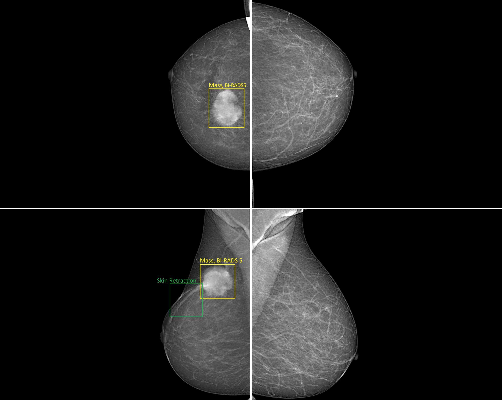

[<p align="center"></p>](https://vindr.ai/)
# VinDr-Mammo: A large-scale benchmark dataset for computer-aided diagnosis in full-field digital mammography
[<p align="center"></p>](https://vindr.ai/datasets/mammo)

[](https://opensource.org/licenses/Apache-2.0)

# Description
This repository provides code used for de-identification and stratification of the VinDr-Mammo dataset, which can be downloaded via [our project on Physionet](https://physionet.org/content/vindr-mammo/1.0.0/) . Python script for visualization of DICOM image is also provided.

# Installation

To install required package via Pip, run 
```bash
pip install -r requirements.txt
```

# De-identification
See the [deidentification.py](deidentification.py) file for more details. 

# Data Stratification
Please refer to the [stratification.py](stratification.py) file and the [split_data.ipynb](split_data.ipynb) notebook.
You may need to change the GLOBAL_PATH and LOCAL_PATH variables in split_data.ipynb to proper paths to the annotations files.
# Visualization
Change the dicom_path variable in the [visualize.py](visualize.py) file to your desired DICOM file for visualization.

```bash
python visualize.py
```
# License
This source code in released under [Apache 2.0 License](LICENSE).


# Citing
If you use the VinDr-Mammo dataset in your research please use the following BibTeX for citation:

```BibTeX
@article{Nguyen2022.03.07.22272009,
  author={Nguyen, Hieu T. 
    and Nguyen, Ha Q. 
    and Pham, Hieu H. 
    and Lam, Khanh 
    and Le, Linh T. 
    and Dao, Minh 
    and Vu, Van},
  title={VinDr-Mammo: A large-scale benchmark dataset for computer-aided diagnosis in full-field digital mammography},
  year={2022},
  doi={10.1101/2022.03.07.22272009},
  URL={https://www.medrxiv.org/content/early/2022/03/10/2022.03.07.22272009},
  journal={medRxiv}
}
```
